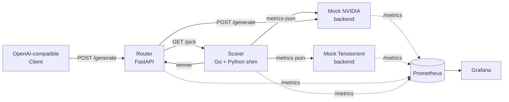

# tt-llm-d-deploy

> End-to-end reference deployment for heterogeneous LLM inference routing across mixed accelerator fleets.

[](https://github.com/spartow/tt-llm-d-deploy/actions/workflows/test.yml)
[](LICENSE)

`tt-llm-d-deploy` is the demo and benchmark harness for [`tt-llm-d-scorer`](https://github.com/spartow/tt-llm-d-scorer) — a cost- and SLO-aware endpoint scorer designed to route LLM inference requests across mixed NVIDIA, AMD, and Tenstorrent accelerator pools.

**The thesis:** a single inference gateway can serve a model across heterogeneous accelerator classes, picking the right backend per request based on cost, latency SLOs, queue depth, and KV-cache pressure — and the cost savings versus single-vendor deployment are measurable and significant.

This repository proves it end-to-end on Kubernetes with reproducible benchmarks.

## Architecture



The **router** exposes an OpenAI-compatible endpoint, consults the **scorer** for the optimal backend, then forwards the request. All components export Prometheus metrics; Grafana dashboards visualize routing decisions, p50/p95 latency by vendor, and cost-per-token in real time.

## Status

Active early-stage development. v0.1 milestones:

- [x] Mock NVIDIA + Tenstorrent backends with configurable latency, cost, queue depth, and health
- [x] Router service with scorer integration and request-level routing telemetry
- [x] Prometheus + Grafana observability stack with pre-loaded dashboards
- [x] Benchmark harness (`benchmark/bench.py`) producing CSV output
- [x] Routing-policy comparator (`benchmark/route_decision.py`)
- [ ] Real `llm-d` `Scorer` interface implementation (currently a standalone service — see roadmap)
- [ ] Real vLLM backend replacing one mock (currently FastAPI + `time.sleep`)
- [ ] Real-hardware benchmark report (NVIDIA H100 + AMD MI300X via cloud rentals)
- [ ] Helm chart

## Quickstart

### Prerequisites

- Docker
- `kind` (Kubernetes in Docker)
- `kubectl`
- Python 3.11+

### Local kind cluster

```bash
# 1. Create a local cluster
kind create cluster --name hetroserve

# 2. Build images and load them into kind
make build-images load-kind

# 3. Deploy the stack
kubectl apply -k k8s/base
kubectl apply -k k8s/observability

# 4. Wait for everything to be ready
./scripts/status.sh

# 5. Send a request through the router
kubectl port-forward -n hetroserve-demo svc/hetroserve-router 8081:8081 &
curl -X POST http://localhost:8081/generate \
  -H "Content-Type: application/json" \
  -d '{"prompt": "What is heterogeneous LLM serving?", "max_tokens": 64}'
```

The response includes routing telemetry — which backend was selected, why, and what the scorer's other candidates looked like.

### Run the benchmark

```bash
# Port-forward backend services so the local benchmark client can hit them
kubectl port-forward -n hetroserve-demo svc/mock-nvidia 8101:8000 &
kubectl port-forward -n hetroserve-demo svc/mock-tenstorrent 8102:8000 &

# Run a 50-request benchmark across both backends
python -m benchmark.bench --requests 50 --max-tokens 128

# Apply different routing policies to the same captured data
make route-lowest-cost     # cheapest backend per request
make route-lowest-latency  # fastest backend per request
make route-slo-cost        # cheapest backend that meets the latency SLO
```

This last command is the headline: same requests, same data, three policies, three different cost/latency outcomes — quantified.

### Observability

```bash
kubectl port-forward -n hetroserve-demo svc/grafana 3000:3000
# Open http://localhost:3000 — default credentials admin / admin
```

The pre-loaded dashboard shows routing decisions by vendor, p50/p95/p99 latency per backend, cost per 1K tokens, queue depth, and KV-cache pressure.

## Repository layout

```
tt-llm-d-deploy/
├── router/              # FastAPI router with scorer integration
├── mock-backend/        # Configurable mock vLLM-style backend
├── benchmark/           # Benchmark harness + routing-policy comparator
├── k8s/
│   ├── base/            # Core deployments (router, backends)
│   └── observability/   # Prometheus + Grafana stack
└── scripts/
    └── status.sh        # Cluster health check
```

## Related repositories

- [`tt-llm-d-scorer`](https://github.com/spartow/tt-llm-d-scorer) — the Go scorer library and HTTP service
- [`tt-llm-d-platform`](https://github.com/spartow/tt-llm-d-platform) — vLLM platform plugin (in progress)

## Roadmap to v0.2

The current scorer is a standalone HTTP service that the router consults out-of-band. The next milestone is to make it a real `llm-d` Endpoint Picker:

1. Implement the `Scorer` interface from `sigs.k8s.io/gateway-api-inference-extension/pkg/epp/scheduling` so it plugs directly into `llm-d-inference-scheduler`
2. Replace one mock backend with real vLLM serving a small open model (Qwen2.5-0.5B on CPU) to validate the end-to-end inference path
3. Publish a benchmark report comparing routing policies on real heterogeneous hardware (NVIDIA H100 on Lambda Labs vs AMD MI300X on Runpod / Hot Aisle)

## Contributing

See [CONTRIBUTING.md](CONTRIBUTING.md). The project is in early development — issues, PRs, and design feedback on the scoring model are especially welcome.

## License

Apache 2.0 — see [LICENSE](LICENSE).
